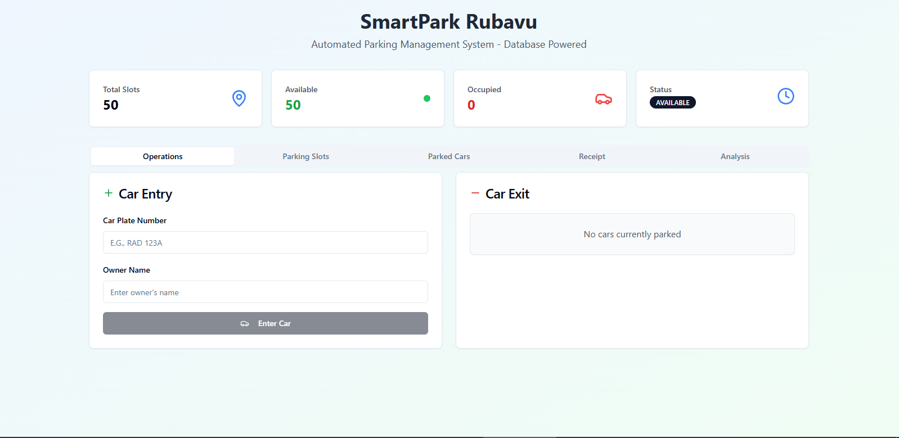
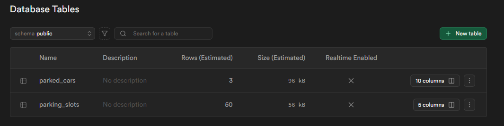

## 🚗 Simple Car Parking Platform

**SmartPark** is a lightweight and efficient car parking management system built to streamline vehicle entry, tracking, and billing. Designed for simplicity and speed, it’s ideal for small parking lots, campuses, and urban districts.

---

### 📌 Key Features

* 🆔 Token-based entry with vehicle number, slot, and timestamp
* ⏳ Real-time parking duration tracking
* 💰 Automated billing: Rwf 500/hour + Rwf 300 for extra hours
* 🗂️ Organized data for easy audit and reports
* 🌐 Simple UI/UX for attendants and admins

---

### 🧠 Tech Stack

* **Frontend:** React, HTML, CSS, JavaScript
* **Backend:** Node.js / Lovable.dev *(specify yours)*
* **Database:** Supabase

---

### 📍 Use Case Example

Ideal for:

* Local district parking (like Rubavu)
* Private compounds or office spaces
* School or university campus lots

---

### 🚀 Future Improvements

* QR code entry & exit
* SMS notifications for drivers
* Dashboard for analytics & reports
* Mobile app integration

Here are Some Images of What Included in Developmeny:Web App UI 
Database View: 
